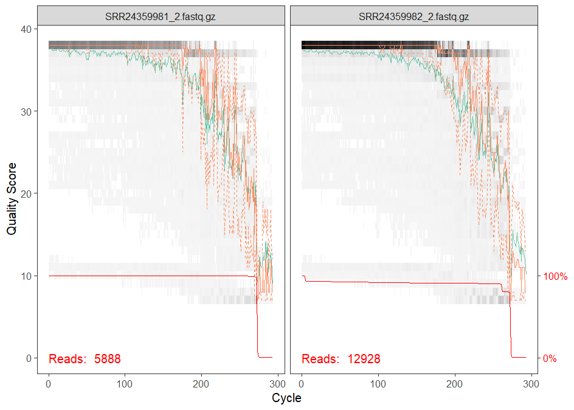

```{r knitr_opts, echo=FALSE}
knitr::opts_chunk$set(
  class.source = "script-source",
  class.output = "script-output",
  comment = NA
)
```


#  `r fontawesome::fa("book", fill=" #722F37")`  Prefacio {-}

Este libro contiene los temas y códigos a ver en el taller "Introducción práctica a la bioinformática de microbiotas en R y Rstudio". 

## Objetivos del curso

Que los asistentes adquieran habilidades prácticas y un conocimiento avanzado sobre herramientas de  bioinformática en el estudio de microbiotas usando R y Rstudio

## Público a quien va dirigido

Este curso está dirigido a estudiantes y profesionistas que están familiarizados con el uso de R y Rstudio y desean adquirir  habilidades en el  análisis de datos de secuenciación masiva y microbiotas usando R y Rstudio.

En este curso aprenderás a usar un flujo de trabajo en el que se importarán, se procesarán y se analizarán datos de microbiomas de un estudio de transferencia materna de microbiota.

## Pre-requisitos
- Conocimiento básico en R y Rstudio
- Equipo de cómputo (16GB de RAM y 1 GB de espacio) 


<!--chapter:end:index.Rmd-->

---
bibliography: references.bib
---
# `r fontawesome::fa("book", fill="#722F37")` : Descargando las secuencias del NCBI

Las secuencias que utilizaremos son del artículo:
[Montoya-Ciriaco, Nina, et al. "Maternal transmission of bacterial microbiota during embryonic development in a viviparous lizard." Microbiology Spectrum 11.6 (2023): e01780-23.](https://journals.asm.org/doi/full/10.1128/spectrum.01780-23)


Para descargar las secuencias del NCBI hay varias opciones:

1. **[Página de NCBI](https://www.ncbi.nlm.nih.gov/sra/docs/sradownload)**: Esto lo podemos hacerde forma manual con el número de Bioproject, por ejemplo: [PRJNA963006](https://www.ncbi.nlm.nih.gov/bioproject/?term=PRJNA963006).


2. **SRAtoolkit**: Para instalar esta herramienta, consultar esta [liga](https://github.com/ncbi/sra-tools/wiki/02.-Installing-SRA-Toolkit).

3. Hay otras herramientas como bash linux, aspera connect, qiime2-fondue, etc.


## Descargar secuencias con SRAtoolkit

- Archivo con los SRA ids, *sra_ids.txt*:

```{bash, eval=FALSE}
SRR1234567
SRR1234568
SRR1234569

```


```{bash, eval=FALSE}
mkdir -p ./fastq_output

while read srr; do
    echo "Procesando $srr ..."

    # 1. Descargar el .sra si no existe
    if [ ! -f ./sra_files/$srr.sra ]; then
        mkdir -p ./sra_files
        prefetch -O ./sra_files $srr
    fi

    # 2. Convertir a FASTQ gzip
    fasterq-dump ./sra_files/$srr.sra \
        --split-files \
        --origfmt \
        --gzip \
        -O ./fastq_output

done < sra_ids.txt

```


## Descargando secuencias ejemplo

- Lo primero que haremos será crear un directorio donde depositaremos los archivos de ejemplo.

Luego, vamos a descargar las secuencias que vamos a utilizar para este ejemplo y descomprimirlas.

[Liga a las secuencias](https://drive.google.com/drive/folders/16rhfjOPm-qbxS_VpEGN8PCGN8_lcgHjm?usp=drive_link)


::: {.alert .alert-success role="warning"}
<i class="bi-check-circle-fill"></i> **Sugerencia**: Abrir un proyecto nuevo para este taller donde deposites las secuencias y vayas poniendo el script y código.
::: 

<!--chapter:end:capitulo_1.Rmd-->

---
bibliography: references.bib
---


# `r fontawesome::fa("book", fill=" #722F37")` : Importar secuencias a Rstudio

Ya habiendo descargado las secuencias podemos importarlas a Rstudio para ser procesadas.

```{r, eval=TRUE}
# Ajuste de rutas y directorio de trabajo
# ruta que contiene los archivos fastq
ruta_fastq <- "C:/Users/shere/Documents/microbiome_bioinformatics_transfer/Datos/seqs_transfer/"

# Crear carpeta para guardar resultados y ajusta directorio de trabajo
ruta_resultados <-"C:/Users/shere/Documents/microbiome_bioinformatics_transfer/resultados"
setwd(ruta_resultados)

fnFs <- sort(list.files(ruta_fastq, pattern = "_1.fastq.gz", full.names = TRUE))
fnRs <- sort(list.files(ruta_fastq, pattern = "_2.fastq.gz", full.names = TRUE))
```


```{r}
head(fnFs)
```


```{r}
head(fnRs)
```

```{r, echo=FALSE}
setwd("../")

```


<!--chapter:end:capitulo_2.Rmd-->

---
bibliography: references.bib
---


# `r fontawesome::fa("book", fill=" #722F37")` : Remoción de primers 

- Instalar librerías a usar en todo el flujo de trabajo

```{r, eval=FALSE}
install.packages("tidyverse")

if (!require("BiocManager", quietly = TRUE))
    install.packages("BiocManager")

BiocManager::install("phyloseq")
BiocManager::install("Biostrings")
BiocManager::install("dada2")
BiocManager::install("ShortRead")

```


- Cargar librerías

```{r}
library(dada2)
library(Biostrings)
library(ShortRead)
```

- Primers y sus reversos complementarios

```{r}
# Primers usados en PCR
FWD <- "CCTACGGGNGGCWGCAG"
REV <- "GACTACHVGGGTATCTAATCC"

allOrients <- function(primer) {
  require(Biostrings)
  dna <- DNAString(primer) 
  orients <- c(Forward = dna, Complement = complement(dna), Reverse = reverse(dna), 
               RevComp = reverseComplement(dna))
  return(sapply(orients, toString))  # Convertir de nuevo a vector de caracteres
}

# Determinar todas las orientaciones posibles de los primers
FWD.orients <- allOrients(FWD)
REV.orients <- allOrients(REV)
FWD.orients
```
- Filtrado previo para detección de primers

```{r, eval=FALSE}
#esta parte toma aprox: 9 min

# Crear un directorio nuevo con filtrado 
fnFs.filtN <- file.path(ruta_resultados, "filtN", basename(fnFs)) 
fnRs.filtN <- file.path(ruta_resultados, "filtN", basename(fnRs))

filterAndTrim(fnFs, fnFs.filtN, fnRs, fnRs.filtN, maxN = 0, multithread = TRUE)
```

- Detectar si hay primers presentes 

```{r, eval=FALSE}
primerHits <- function(primer, fn) {
  # Cuenta el numero de lecturas en donde se encontraron primers
  nhits <- vcountPattern(primer, sread(readFastq(fn)), fixed = FALSE)
  return(sum(nhits > 0))
}

# Crear tabla para la deteccion de los primers
primeres_detected <- rbind(FWD.ForwardReads = sapply(FWD.orients, primerHits, fn = fnFs.filtN[[1]]), 
                           FWD.ReverseReads = sapply(FWD.orients, primerHits, fn = fnRs.filtN[[1]]), 
                           REV.ForwardReads = sapply(REV.orients, primerHits, fn = fnFs.filtN[[1]]), 
                           REV.ReverseReads = sapply(REV.orients, primerHits, fn = fnRs.filtN[[1]]))

primeres_detected

```
```{r, eval=TRUE, echo=FALSE}
#write.csv(primeres_detected, "primers_detected.csv")
primers_detected = read.csv("primers_detected.csv", check.names = F)
primers_detected
```


- Remoción de primers con cutadapt

[Cutadapt](liga) es una herramienta que nos permitirá remover los primers que se encuentren aún en las secuencias.
Este programa se debe descargar según el sistema operativo y colocar la ruta.

Para correr cutadpat en R debemos instalar cutadapt y para usarlo en windows debemos instalar:

- [Python3](https://www.python.org/downloads/release/python-3115/)
- [Visual studio](https://visualstudio.microsoft.com/es/downloads/) con la opción de C++ y Python tools.

Luego, abrimos la terminal de comandos de windows (cmd.exe) y corremos:
```{bash, eval=FALSE}
py -m pip install cutadapt
```

Si quedó bien instalada nos dará la versión instalada, con este código:

```{bash, eval=FALSE}
py -m cutadapt --version
```

```{r, eval=FALSE}
#poner ruta aquí
cutadapt <- "C:/Users/shere/AppData/Local/Programs/Python/Python314/Scripts/cutadapt.exe" # en mi pc está aquí

system2(cutadapt, args = "--version") 
```


```{r, eval=FALSE}
#correr cutadapt
path.cut <- file.path(ruta_fastq, "cutadapt")
if(!dir.exists(path.cut)) dir.create(path.cut)
fnFs.cut <- file.path(path.cut, basename(fnFs))
fnRs.cut <- file.path(path.cut, basename(fnRs))

FWD.RC <- dada2:::rc(FWD)
REV.RC <- dada2:::rc(REV)
R1.flags <- paste("-g", FWD, "-a", REV.RC) 
R2.flags <- paste("-G", REV, "-A", FWD.RC) 

# Correr Cutadapt
for (i in seq_along(fnFs)) {
  system2(
    cutadapt,
    args = c(
      R1.flags,
      R2.flags,
      "-n",2,
      "-o", fnFs.cut[i],
      "-p",fnRs.cut[i],
      fnFs.filtN[i],
      fnRs.filtN[i],
      "--minimum-length=1"
    )
  ) 
}
```

- Detectar si fueron removidos los primers

```{r, eval=FALSE}
primers_detected_despues = rbind(
  FWD.ForwardReads = sapply(FWD.orients, primerHits, fn = fnFs.cut[[1]]),
  FWD.ReverseReads = sapply(FWD.orients, primerHits, fn = fnRs.cut[[1]]),
  REV.ForwardReads = sapply(REV.orients, primerHits, fn = fnFs.cut[[1]]),
  REV.ReverseReads = sapply(REV.orients, primerHits, fn = fnRs.cut[[1]])
)


```

```{r, echo=FALSE}
#write.csv(primers_detected_despues ,"primers_detected_despues.csv")
primers_detected_despues = read.csv("primers_detected_despues.csv", check.names = F)
primers_detected_despues 
```


<!--chapter:end:capitulo_3.Rmd-->

---
bibliography: references.bib
---


# `r fontawesome::fa("book", fill=" #722F37")` : Flujo de trabajo de DADA2

Para el análisis de estas secuencias utilizaremos [DADA2](https://benjjneb.github.io/dada2/).


- Ubicar las secuencias ya limpias sin primers
```{r, echo=FALSE}
ruta_fastq <- "C:/Users/shere/Documents/microbiome_bioinformatics_transfer/Datos/seqs_transfer/"
path.cut <- file.path(ruta_fastq, "cutadapt")
```


```{r}
# Ruta
cutFs <- sort(list.files(path.cut, pattern = "_1.fastq.gz", full.names = TRUE))
cutRs <- sort(list.files(path.cut, pattern = "_2.fastq.gz", full.names = TRUE))

# Extraer nombres
get.sample.name <- function(fname) strsplit(basename(fname), "_")[[1]][1]
sample.names <- unname(sapply(cutFs, get.sample.name))
head(sample.names)
```


```{r, echo=FALSE}
vector =c("SRR24359981", "SRR24359982", "SRR24359983", "SRR24359984",
"SRR24359985", "SRR24359986")
print(vector)
```

- Realizar un gráfico de inspección de calidad

```{r, eval=FALSE}
plotQualityProfile(cutFs[1:2])
plotQualityProfile(cutRs[1:2])
```

```{r, echo=FALSE}
knitr::include_graphics("resultados/Rplot01.png")

```

```{r, echo=FALSE}


```

## Filtrado y corte de secuencias

```{r, eval=FALSE}
# duración: 10 min aprox
filtFs <- file.path(ruta_resultados, "filtered2", basename(fnFs))
filtRs <- file.path(ruta_resultados, "filtered2", basename(fnRs))
filtFs

names(filtFs) <- sample.names
names(filtRs) <- sample.names

out <- filterAndTrim(fnFs, filtFs, fnRs, filtRs, truncLen=c(280,200),maxN=0, maxEE=c(2,2), 
truncQ=2, rm.phix=TRUE,compress=TRUE, multithread=TRUE) 

out
```

```{r, echo=FALSE}
#write.csv(out, "out.csv")
out = read.csv("out.csv", check.names = F)
out
```


## Modelo de error

```{r, eval=FALSE}
#duración = 11 min aprox.
errF <- learnErrors(filtFs, multithread = TRUE)
errR <- learnErrors(filtRs, multithread = TRUE)

png("error_model.png", 
    units = "in",
    height = 7,
    width = 10,
    res = 300)
plotErrors(errF)
dev.off()
```

```{r, echo=FALSE}
#saveRDS(errR, "errR.RDS")
knitr::include_graphics("resultados/Rplot02.png")

```


## Dereplicación

```{r, eval=FALSE}
#duración = 2 min aprox
derepFs <- derepFastq(filtFs, verbose = TRUE)
derepRs <- derepFastq(filtRs, verbose = TRUE)
#saveRDS(derepFs, "derepFs.RDS")
```

## Inferencia de ASVs

```{r, eval=FALSE}
#duración = 4 min aprox
dadaFs <- dada(derepFs, err = errF, multithread = TRUE)
dadaRs <- dada(derepRs, err = errR, multithread = TRUE)
#saveRDS(dadaRs, "dadaRs.RDS")
```


## Uniendo secuencias 
```{r, eval=FALSE}
mergers <- mergePairs(dadaFs, derepFs, dadaRs, derepRs, verbose=TRUE)
#saveRDS(mergers, "mergers.RDS")
```

```{r, echo=FALSE}
mergers = readRDS("mergers.RDS")
```


## Remoción de quimeras

```{r}
#tabla
seqtab <- makeSequenceTable(mergers)
dim(seqtab)
```


```{r}
#remoción quimeras
seqtab_nochim <- removeBimeraDenovo(seqtab,
                                    method = "consensus",
                                    multithread = T,
                                    verbose = T)
dim(seqtab_nochim)
```

## Estadísticos

```{r, eval=FALSE}
getN <- function(x)sum(getUniques(x))
stats <- cbind(
  out,
  sapply(dadaFs, getN),
  sapply(dadaRs, getN),
  sapply(mergers, getN),
  rowSums(seqtab_nochim)
)

colnames(stats) <- c("input",
                     "filtered",
                     "denoisedF",
                     "denoisedR",
                     "merged",
                     "nonchim")

stats
write.csv(stats, "denoising-stats.csv")

```

```{r, echo=FALSE}
stats = read.csv("denoising-stats.csv")

stats
```


<!--chapter:end:capitulo_4.Rmd-->

---
bibliography: references.bib
---


# `r fontawesome::fa("book", fill=" #722F37")` : Asignación taxonómica

## Base de datos Greengenes2 

::: {.alert .alert-info role="alert"}
<i class="bi-clipboard-fill"></i> En la siguiente parte se descarga la base de datos de greengenes2 y se depura manualmente en R. Esta parte no la vamos a correr, solo dejamos el script para que lo intentes con más tiempo y disponibilidad.
:::


```{r, eval=FALSE}
#https://github.com/benjjneb/dada2/issues/1680#issuecomment-1724495374

download.file("http://ftp.microbio.me/greengenes_release/current/2024.09.backbone.full-length.fna.qza", "2024.09.backbone.full-length.fna.qza")
download.file("http://ftp.microbio.me/greengenes_release/current/2024.09.backbone.tax.qza",
              "2024.09.backbone.tax.qza")

unzip("2024.09.backbone.full-length.fna.qza")
unzip("2024.09.backbone.tax.qza")


fn <- "5b42d9b6-2f24-4f01-b989-9b4dafca7d5e/data/dna-sequences.fasta"
txfn <- "b7c3e691-ea51-4547-94dd-f79f49e41a36//data/taxonomy.tsv"

sq <- getSequences(fn)
tdf <- read.csv(txfn, sep="\t", header=TRUE)
tdf2 <- tdf[match(names(sq), tdf$Feature.ID),]
tax <- tdf2[,2]
names(tax) <- tdf2[,1]

identical(names(sq), names(tax)) # TRUE

taxes <- strsplit(tax, "; ")
tax.depth <- sapply(taxes, length)
table(tax.depth) 
# Todas las taxonomias son de 7 niveles
# Nota: Las especies tienen generos con nombres duplicados en vez de especies

# Remover el género de las especies
for(i in seq(length(taxes))) {
  gen <- taxes[[i]][[6]]
  gen <- substr(gen, 4, nchar(gen))
  taxes[[i]][[7]] <- gsub(gen, "", taxes[[i]][[7]])
  taxes[[i]][[7]] <- gsub("__ ", "__", taxes[[i]][[7]])
}

tax_pre <- c("d__", "p__", "c__", "o__", "f__", "g__", "s__")
is.unassigned <- sapply(taxes, function(tx) {
  tx == tax_pre
}) |> t()
tax.depth <- apply(is.unassigned, 1, function(isu) { min(which(isu)-1L, 7L) })
tax.ids <- sapply(seq_along(taxes), function(i) {
  td <- tax.depth[[i]]
  id.str <- paste(taxes[[i]][1:td], collapse=";")
  id.str <- paste0(id.str, ";") # Add terminal semicolon
  id.str
})
names(tax.ids) <- names(taxes)
# Write out the training fasta file
sq.out <- sq
names(sq.out) <- tax.ids
writeFasta(sq.out, "greengenes2_trainset.fa.gz", compress=TRUE)
# Sanity test the results of `assignTaxonomy` on this newly created training
dada2:::tax.check("greengenes2_trainset.fa.gz", fn.test=system.file("extdata", "ten_16s.100.fa.gz", package="dada2"))
```


Te dejamos mejor la liga para que descargues la base de datos de referencia ya depurada en su última versión, [Liga](https://drive.google.com/file/d/11NzusIlBFoX5zXBiG7Y8WJbqGYEdYyoo/view?usp=drive_link)

La descargamos y la ponemos en nuestro directorio de trabajo.


## Asignación taxonómica

```{r, eval=FALSE}
#duración : aprox 7 min

classifier <- "greengenes2_trainset.fa.gz" 
taxa <- assignTaxonomy(seqtab_nochim, classifier, multithread = TRUE, tryRC = TRUE)

# Visualizar lo que se genero despues de la asignacion
taxa_print <- taxa
rownames(taxa_print) <- NULL

head(taxa_print)
dim(taxa_print)
```


```{r, echo=FALSE}
#write.csv(taxa, "taxa.csv")
taxa_print = read.csv("taxa_print.csv", check.names = F)
head(taxa_print)
dim(taxa_print)
```


```{r, eval=FALSE}
# Exportar objetos generados durante el preprocesamiento 
save( errF, dadaFs, dadaRs,seqtab_nochim, taxa,
      file = "data.RData")
write.csv(taxa, "taxonomy.csv")
write.csv(seqtab_nochim, "table.csv")
write.csv(stats, "stats.csv")

```


<!--chapter:end:capitulo_5.Rmd-->


# `r fontawesome::fa("book", fill=" #722F37")` : Análisis exploratorio

- Primero vamos  a cargar las librerías a usar

```{r, echo=FALSE}
taxa = read.csv("taxa.csv", row.names = 1)
taxa <- as.matrix(taxa)
mode(taxa) <- "character"
```


```{r}
library(phyloseq)
library(Biostrings)
library(tidyverse)
theme_set(theme_bw())
```

- Cargamos la metadata y ordenamos

```{r}
samples.out <- rownames(seqtab_nochim)
samdf <-read.delim("Datos/seqs_transfer/sra-metadata.tsv") %>% 
  dplyr::rename(Origen="Host.Life.Stage..sample.", Tipo="Host.Tissue.Sampled..sample.")
seqtab.nochim <- seqtab_nochim[match(samdf$ID, rownames(seqtab_nochim)),]
rownames(samdf) <- samdf$ID
```


- Construimos un objeto phyloseq

```{r}
ps <- phyloseq(otu_table(seqtab.nochim, taxa_are_rows=FALSE), 
               sample_data(samdf), 
               tax_table(taxa))
ps
```

- Renombramos los ids de las secuencias y agregamos el rep_seqs

```{r}
dna <- Biostrings::DNAStringSet(taxa_names(ps))
names(dna) <- taxa_names(ps)
ps <- merge_phyloseq(ps, dna)
taxa_names(ps) <- paste0("ASV", seq(ntaxa(ps)))
ps

```

## Composición taxonómica

```{r}
ps.prop <- transform_sample_counts(ps, function(OTU) OTU/sum(OTU))
```


### Phylum

```{r}
my_phyla <- tax_glom(ps.prop ,taxrank = "Phylum")
my_bar_phyla <- plot_bar(my_phyla, fill="Phylum") + 
facet_grid(~Origen+Tipo, scales="free_x")+
  ggtitle("Abundancia relativa de Filos") 
my_bar_phyla
```

### Class

```{r}
my_Class <- tax_glom(ps.prop ,taxrank = "Class")
my_bar_Class <- plot_bar(my_Class, fill="Class") + 
facet_grid(~Origen+Tipo, scales="free_x")+
  ggtitle("Abundancia relativa de clases") 
my_bar_Class
```

## Diversidad alfa

- Primero hacemos subconjuntos del origen

```{r}

#madre
madre <- subset_samples(ps, Origen=="adult")
madre

#embrion
embrion <- subset_samples(ps, Origen=="embryo")
embrion

```
- Graficamos la diversidad alfa

```{r}
plot_richness(madre, x="Tipo", measures=c("Observed","Shannon", "Simpson"), color="Tipo")

```
```{r}
plot_richness(madre, x="Tipo", measures=c("Observed","Shannon", "Simpson"), color="Tipo")+
  geom_boxplot()
```

```{r}
plot_richness(embrion, x="Tipo", measures=c("Observed","Shannon", "Simpson"), color="Tipo")+
  geom_boxplot()

```
- rarificar si es necesario

```{r}
#ps_rare <- rarefy_even_depth(ps_fil, sample.size = min(sample_sums(ps_fil)), rngseed = 19)
#ps_rare
```


## Diversidad beta

```{r}
# Transformar la data  proporciones
ps.prop <- transform_sample_counts(ps, function(otu) otu/sum(otu))
ord.nmds.bray <- ordinate(ps.prop, method="NMDS", distance="bray")
plot_ordination(ps.prop, ord.nmds.bray, color="Tipo", shape="Origen",title="Bray NMDS")
```

```{r}
ord.nmds.jac <- ordinate(ps.prop, method="PCoA", distance="jaccard")
plot_ordination(ps, ord.nmds.jac, color="Tipo", shape="Origen",title="Bray NMDS")
```
## MicroBioMeta

[MicroBioMeta](https://github.com/Steph0522/MicroBioMeta): Paquete en desarrollo para la exploración de datos de microbioma y metagenómicos.

```{r, eval=FALSE}
install.packages("devtools")
library(devtools)
install_github("Steph0522/MicroBioMeta")
library(MicroBioMeta)
```

### Pre-procesamiento

```{r}
taxonomys <- taxa %>%
  as.data.frame() %>%
  tidyr::unite("taxonomy", Kingdom:Species, sep = ";")
```


```{r}
tabla = merge_feature_taxonomy(t(seqtab.nochim), taxonomys)
```


### Diversidad alpha


```{r, warning=FALSE}
alpha_hill_plot(
  table = tabla,
  metadata = samdf,
  x_col = "Tipo",
  fill_col = "Tipo",
  stat = "anova"
) + theme(axis.text.x = element_blank(),
          axis.ticks.x = element_blank())

```

## Diversidad beta

```{r, warning=FALSE}
beta_div_plot(
  table = tabla,
  metadata = samdf,
  group_col = "Tipo",
  shape_col = "Origen",
  ordination = "PCoA",
  distance = "aitchison"
)
```


## Composición
```{r, eval=FALSE}
abundance_barplot(
  table = tabla,
  metadata = samdf,
  level = "phylum",
  top_n_groups = 10,
  x_col = "Tipo",
  facet_col = "Origen"
)
```
```{r, warning=FALSE}
abundance_heatmap_plot(
  table = tabla,
  metadata = samdf,
  condition1 = "Origen",
  condition2 = "Tipo",
  top_n = 20,
  cluster = TRUE,
  show_column_names = FALSE
)
```


<!--chapter:end:capitulo_6.Rmd-->

