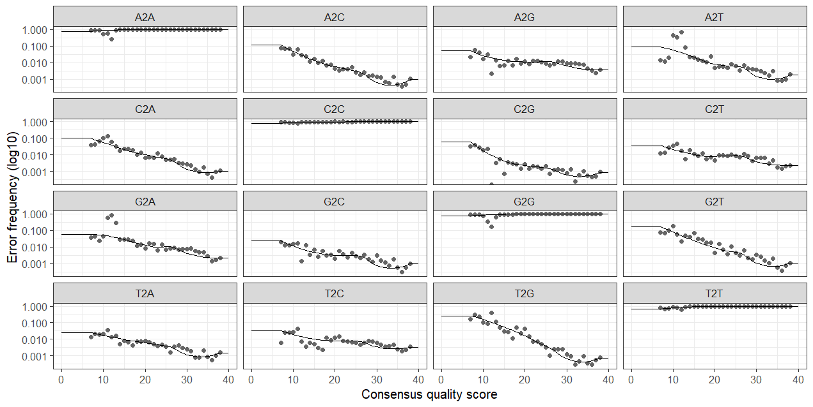

# `r fontawesome::fa("book", fill=" #722F37")` : Flujo de trabajo de DADA2

Para el análisis de estas secuencias utilizaremos [DADA2](https://benjjneb.github.io/dada2/).


- Ubicar las secuencias ya limpias sin primers
```{r, echo=FALSE}
ruta_fastq <- "C:/Users/shere/Documents/microbiome_bioinformatics_transfer/Datos/seqs_transfer/"
path.cut <- file.path(ruta_fastq, "cutadapt")
```


```{r}
# Ruta
cutFs <- sort(list.files(path.cut, pattern = "_1.fastq.gz", full.names = TRUE))
cutRs <- sort(list.files(path.cut, pattern = "_2.fastq.gz", full.names = TRUE))

# Extraer nombres
get.sample.name <- function(fname) strsplit(basename(fname), "_")[[1]][1]
sample.names <- unname(sapply(cutFs, get.sample.name))
head(sample.names)
```


```{r, echo=FALSE}
vector =c("SRR24359981", "SRR24359982", "SRR24359983", "SRR24359984",
"SRR24359985", "SRR24359986")
print(vector)
```

- Realizar un gráfico de inspección de calidad

```{r, eval=FALSE}
plotQualityProfile(cutFs[1:2])
plotQualityProfile(cutRs[1:2])
```

```{r, echo=FALSE}


```

```{r, echo=FALSE}
knitr::include_graphics("resultados/Rplot.png")

```

## Filtrado y corte de secuencias

```{r, eval=FALSE}
# duración: 10 min aprox
filtFs <- file.path(ruta_resultados, "filtered2", basename(fnFs))
filtRs <- file.path(ruta_resultados, "filtered2", basename(fnRs))
filtFs

names(filtFs) <- sample.names
names(filtRs) <- sample.names

out <- filterAndTrim(fnFs, filtFs, fnRs, filtRs, truncLen=c(280,200),maxN=0, maxEE=c(2,2), 
truncQ=2, rm.phix=TRUE,compress=TRUE, multithread=TRUE) 

out
```

```{r, echo=FALSE}
#write.csv(out, "out.csv")
out = read.csv("out.csv", check.names = F)
out
```


## Modelo de error

```{r, eval=FALSE}
#duración = 11 min aprox.
errF <- learnErrors(filtFs, multithread = TRUE)
errR <- learnErrors(filtRs, multithread = TRUE)

png("error_model.png", 
    units = "in",
    height = 7,
    width = 10,
    res = 300)
plotErrors(errF)
dev.off()
```

```{r, echo=FALSE}
#saveRDS(errR, "errR.RDS")


```


## Dereplicación

```{r, eval=FALSE}
#duración = 2 min aprox
derepFs <- derepFastq(filtFs, verbose = TRUE)
derepRs <- derepFastq(filtRs, verbose = TRUE)
#saveRDS(derepFs, "derepFs.RDS")
```

## Inferencia de ASVs

```{r, eval=FALSE}
#duración = 4 min aprox
dadaFs <- dada(derepFs, err = errF, multithread = TRUE)
dadaRs <- dada(derepRs, err = errR, multithread = TRUE)
#saveRDS(dadaRs, "dadaRs.RDS")
```


## Uniendo secuencias 
```{r, eval=FALSE}
mergers <- mergePairs(dadaFs, derepFs, dadaRs, derepRs, verbose=TRUE)
#saveRDS(mergers, "mergers.RDS")
```

```{r, echo=FALSE}
mergers = readRDS("mergers.RDS")
```


## Remoción de quimeras

```{r}
#tabla
seqtab <- makeSequenceTable(mergers)
dim(seqtab)
```


```{r}
#remoción quimeras
seqtab_nochim <- removeBimeraDenovo(seqtab,
                                    method = "consensus",
                                    multithread = T,
                                    verbose = T)
dim(seqtab_nochim)
```

## Estadísticos

```{r, eval=FALSE}
getN <- function(x)sum(getUniques(x))
stats <- cbind(
  out,
  sapply(dadaFs, getN),
  sapply(dadaRs, getN),
  sapply(mergers, getN),
  rowSums(seqtab_nochim)
)

colnames(stats) <- c("input",
                     "filtered",
                     "denoisedF",
                     "denoisedR",
                     "merged",
                     "nonchim")

stats
write.csv(stats, "denoising-stats.csv")

```

```{r, echo=FALSE}
stats = read.csv("denoising-stats.csv")

stats
```

